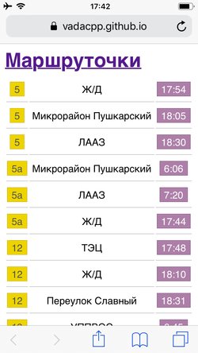
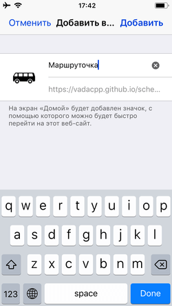

# schedule-pwa 

## Об этом

Приложение, которое показывает ближайшое время прибытия маршрутки

## Основные функции

 + Упорядоченное отображение время прибытия на остановку

## Установка

1. Открыть в Safari [эту](https://vadacpp.github.io/schedule-pwa) страницу и нажать на иконку снизу посередине
2. Нажать на кнопку "На экран «Домой»"
3. И нажать на кнопку "Добавить"

## todo 
 - Научиться писать на JS
 - Web App Manifest

## complete
 - Учет дней недели (некоторые не работают по выходным)
 - Выбор только необходимых маршрутов
 - Отображение расписания на день
 - Написать ServiceWorker для offline работы